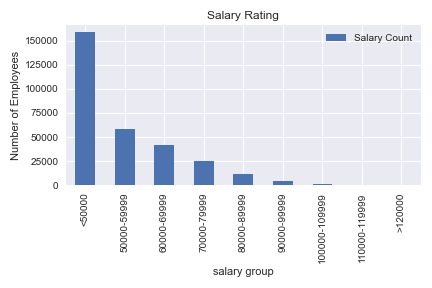
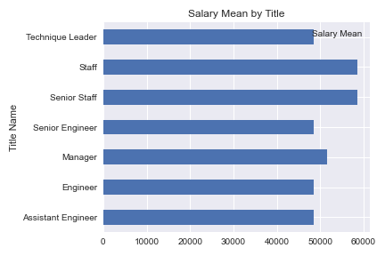

# sql-challenge
# Employee Database: A Mystery in Two Parts

## Background

It is a beautiful spring day, and it is two weeks since you have been hired as a new data engineer at Pewlett Hackard. Your first major task is a research project on employees of the corporation from the 1980s and 1990s. All that remain of the database of employees from that period are six CSV files.

### Data Modeling

### Data Engineering

* Table schema for each of the six CSV files [Schema Table](EmployeeSQL/schematable.sql)

### Data Analysis

* Query for data analysis [Query Employee.sql](EmployeeSQL/query.sql)

### Data Visualization 

* Jupyter Notebook to generate a visualization of the data [Query Employe.ipynb](employeeplots.ipynb)

    ** Create a config.py file with the folow information, in order to run the code:
        host='write name of your host'
        user='write your user name'
        pw='write your password'
        port='write your port number'

* Histogram to visualize the most common salary ranges for employees.

* Bar chart of average salary by title.

